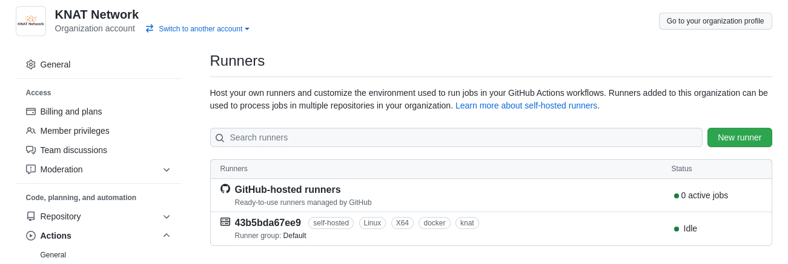

# Simple Self-Hosted GitHub Actions Runner

No Operator, No CRD, No need to blindly apply a `yml` to K8s cluster, only a simple self-hosted GitHub Actions Runner that just works!

## Images

This repo provides the following images, both are Multi-Arch(amd64/arm64 supported):

- `knatnetwork/github-runner:focal-<tag>`
- `ghcr.io/knatnetwork/github-runner:focal-<tag>`

`<tag>` is related to the https://github.com/actions/runner/tags, for example, you may expect a image called `knatnetwork/github-runner:focal-2.290.1` when `v2.290.1` is released.

## Specs

- Images are based on Ubuntu 20.04

## Usage

1. Prepare your GitHub Personal Access Token, which looks like `ghp_xxxxxxxxxxxxx` with `admin:org` permission(If you'd like to register runner to repo, your user must have Admin permission on the related repo), if you don't know how to do it, you can refer to [Creating a personal access token](https://docs.github.com/en/authentication/keeping-your-account-and-data-secure/creating-a-personal-access-token)
2. If you'd like to register runner on a single machine, you can follow the quick start below.
3. If you need to spread multiple runners on multiple nodes using K8s, please take a look at the [documentation](https://runner.knat.network).

### Docker compose Quick Start

This is a quick start example for people to register a runner on single machine using Docker Compose.

First you need to create a `docker-compose.yml` file and write the following content.

```yml
version: '3'

services:
  runner:
    image: knatnetwork/github-runner:focal-2.291.1
    restart: always
    environment:
      RUNNER_REGISTER_TO: 'knatnetwork'
      RUNNER_LABELS: 'docker,knat'
      KMS_SERVER_ADDR: 'http://kms:3000'
      GOPROXY: 'http://goproxy.knat.network,https://proxy.golang.org,direct'
      ADDITIONAL_FLAGS: '--ephemeral'
    volumes:
      - /var/run/docker.sock:/var/run/docker.sock
    depends_on:
      - kms

  kms:
    image: knatnetwork/github-runner-kms:latest
    restart: always
    environment:
      PAT_knatnetwork: 'ghp_Lxxxxxxxxxx2NUk5F'
      PAT_rust-lang: 'ghp_Lxxxxxxxxxx2NUk5F'
```

(If your org's name is `org_name`, then `environment` should be `PAT_org_name: 'ghp_Lxxxxxxxxxx2NUk5F'`)

After that you can use `docker-compose up -d` to start the runner, and now the runner should be registered on `knatnetwork` Org now.



Notes:

- If you want to run runner without docker support inside it, just delete the `volumes`
- If you don't want ephemeral runner(ref: [GitHub Actions: Ephemeral self-hosted runners & new webhooks for auto-scaling](https://github.blog/changelog/2021-09-20-github-actions-ephemeral-self-hosted-runners-new-webhooks-for-auto-scaling/), just remove `ADDITIONAL_FLAGS: '--ephemeral'` line.)
- If you want to register runner to a repo only, you can just change value of `RUNNER_REGISTER_TO` to `<org_name>/<repo_name>`

## Further Reading

For more instructions, please take a look at the [documentation](https://runner.knat.network).

## License

GPL
